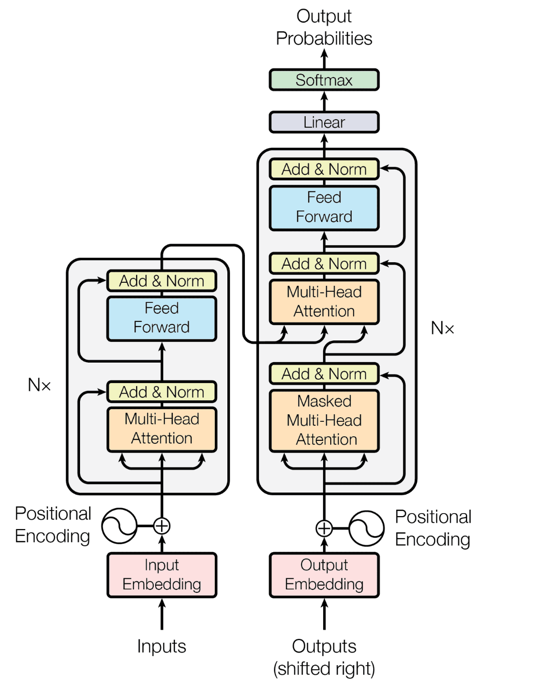
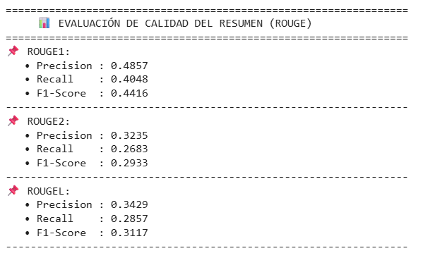
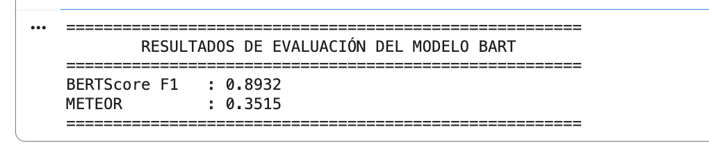
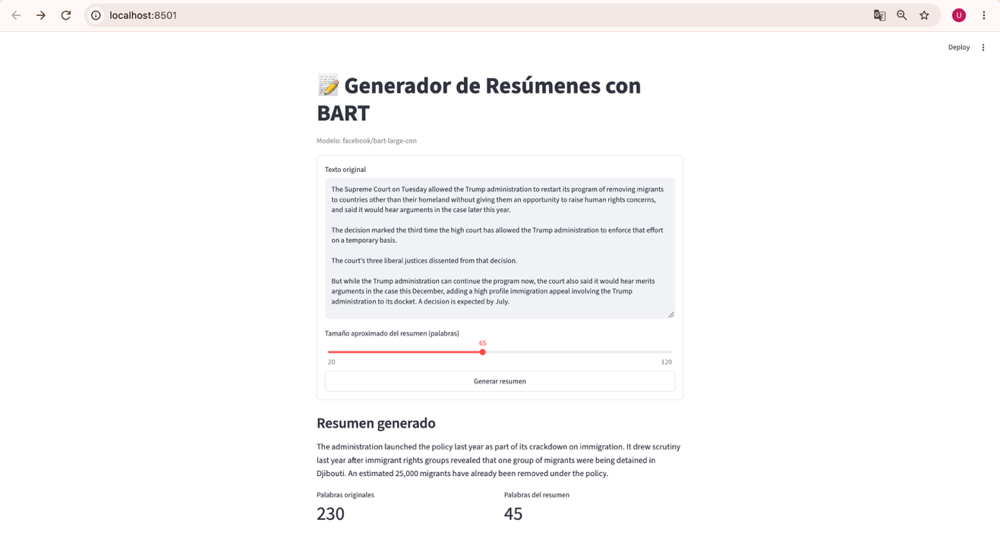

# Implementación del modelo BART: Denoising Sequence-to-Sequence Pre-training for Natural Language Generation, Translation, and Comprehension.

**Estudiantes:** Juan Camilo Perez, Carlos Eduardo Trujillo, Osvaldo Marin

## Resumen

Durante el desarrollo e implementación del proyecto, se utiliza el modelo BART ( Bidirectional and Auto-Regressive Transformer) propuesto por Lewis et al. (2019) en Facebook AI para la generación de resúmenes abstractivos (Text summarization ) a partir de noticias y textos en inglés. BART utiliza una arquitectura de Transformers que combina un codificador bidireccional similar a la estructura de BERT con un decodificador autorregresivo de izquierda a derecha similar a GPT, por lo cual es un modelo ideal para tareas de procesamiento de lenguaje natural que requieren comprensión y generación de textos.

En este caso, se utilizó el modelo pre-entrenado (facebook/bart-large-cnn), ajustado previamente con un corpus de aproximadamente 160 GB de texto compuesto por noticias, historias y libros en inglés, al igual que con datasets de resúmenes conocidos como el CNN/DailyMail y el XSum (Extreme Summarization) los cuales son comúnmente utilizados en tareas de resumen automático de artículos periodísticos en inglés.

Para su implementación, el modelo fue integrado mediante la librería de pesos disponible en Hugging Face Transformers y configurado para generar resúmenes mediante la estrategia de búsqueda beam search. El desempeño del sistema fue evaluado comparando resúmenes generados con sus respectivos textos de referencia empleando las métricas ROUGE-1, ROUGE-2 y ROUGE L sugeridas para esta tarea en específico a lo largo del artículo de investigación, obteniendo como resultado un F1 de 0.4416, 0.2933 y 0.3117 respectivamente, logrando así evidenciar la capacidad del modelo para preservar información relevante del contenido de referencia, aunque su desempeño puede variar según las características, estructura y longitud del texto de entrada.

Por último se desarrolló una interfaz interactiva con Streamlit que permite realizar la generación de resúmenes abstractivos a partir de textos ingresados sin requerir conocimientos técnicos especializados. Así pues, el proyecto permite demostrar la aplicación práctica de una arquitectura Transformers pre-entrenada para tareas de generación de resúmenes abstractivos y permite evaluar cuantitativamente su desempeño mediante métricas ampliamente utilizadas en procesamiento de lenguaje natural.

## Introducción

El proyecto toma como base el articulo “BART: Denoising Sequence-to-Sequence Pre-training for Natural Language Generation, Translation, and Comprehension”, propuesto por Lewis et al. el cual presenta a BART como una arquitectura sequence -to-sequence basada en Transformers que combina un codificador bidireccional con un decodificador autorregresivo para la elaboración de tareas especializadas en la compresión y generación de lenguaje natural como la elaboración de resúmenes abstractivos.

El código y los primeros ejemplos asociados a este modelo fueron publicados por Facebook AI Research en el repositorio Fairseq, así como los procedimientos específicos utilizados para ajuste e inferencia sobre los diferentes conjuntos de datos de resúmenes tales como CNN/DailyMail y XSum.

Bajo este contexto, el problema abordado durante el desarrollo de trabajo surge a raíz del constante crecimiento de la información disponible en medios digitales y la continua actualización de noticias, situaciones que dificultan que los usuarios puedan revisar completamente múltiples artículos e identifiquen rápidamente sus ideas principales. De hecho, el Digital News Report 2026 del Reuters Institute resalta que los medios digitales actualizan información durante todo el transcurso del día, compitiendo por un fracción de tiempo que los usuarios dedican a sus dispositivos móviles lo cual llega a generar una sensación de sobrecarga informativa.

Por esta razón, el resumen automático de textos constituye una alternativa para facilitar el procesamiento de grandes volúmenes de información periodística. Sin embargo, la generación de un resumen requiere mantener la información relevante, conservar la coherencia del contenido y representar las ideas principales del texto de origen. Estas características plantean un desafío para los modelos de procesamiento de lenguaje natural, particularmente en tareas de resumen abstractivo, donde el sistema genera nuevas secuencias de texto a partir de la información comprendida del documento original.

A partir de esto, la motivación de este proyecto consiste en aprovechar las técnicas de procesamiento de lenguaje natural capaces de condensar automáticamente textos extensos en representaciones o versiones más breves y relevantes de los mismo, con el fin de reducir el esfuerzo requerido para comprender el contenido principal de una noticia. Razón por la cual, el objetivo principal es realizar la implementación y evaluación de un sistema de generación automática de resúmenes abstractivos de noticias y textos en ingles mediante el uso del modelo pre-entrenado BART (facebook/bart-large-cnn), analizando su capacidad de preservar información relevante mediante diferentes métricas e integrándolo en una interfaz interactiva desarrollada con Streamlit.

## Marco Teórico

### Arquitectura Transformer y Mecanismo de atención

La arquitectura transformer propuesta por Vaswani et al (2017) suprimió la necesidad de utilizar estructuras de redes recurrentes para procesar datos secuenciales y se encuentra fundamentada principalmente en el mecanismo de Self – Attention, el cual permite establecer relaciones entre diferentes tokens de una secuencia independientemente de su distancia.

Este mecanismo utiliza 3 representaciones principales las cuales son: Query (Q), que representa el elemento que busca información; Key (K), que representa los elementos candidatos y disponibles para ser atendidos; y finalmente el Value (V) que contiene la información que finalmente es utilizada y ponderada. De esta forma, la atención es calculada mediante la formula:

$$
Attention(Q,K,V)=softmax\left(\frac{QK^T}{\sqrt{d_k}}\right)V
$$

En donde dk corresponde a la dimensión de los vectores Key. Este procedimiento permite que el modelo determine dinámicamente que partes de la entrada, en este caso del texto son más relevantes para representar cada uno de los tokens.

### Arquitectura Encoder – Decoder de BART

BART utiliza una arquitectura Transformer de tipo sequence-to-sequence compuesta por un encoder bidireccional y un decoder autorregresivo de izquierda a derecha. Durante su funcionamiento, el encoder procesa simultáneamente toda la secuencia de entrada mediante el mecanismo de Self – Attention, permitiendo asi que cada token incorpore información de su contexto anterior y posterior. Por otra parte, el decoder genera una salida token por token aplicando un mecanismo de Masked Self – Attention el cual impide consultar valores o posiciones futuras mientras se está generando la secuencia con el fin de evitar una fuga de información durante el entrenamiento, es decir que el modelo no aprenda de información que todavía no tiene disponible. Por último, como un puente entre el encoder y el decoder se implementa el mecanismo de Cross – Attention mediante el cual el decoder consulta las representaciones generadas por el encoder.

En BART LARGE, la arquitectura sobre la que se basa facebook/bart-large-cnn se utilizan 12 capas en el encoder y 12 capas en el decoder, con un tamaño de representación oculta de 1024. Esta combinación dentro del modelo integra características similares a BERT por su procesamiento bidireccional, y a GPT debido a su generación autorregresiva.

  

**Figura 1. Arquitectura Transformer Encoder – Decoder. Fuente: [8].**

### Preentrenamiento e innovaciones de BART

La principal innovación del modelo BART en su esquema de preentrenamiento como denoising autoencoder en el cual el texto original dispuesto en la entrada del modelo es alterado mediante la agregación de ruido y cambios con el fin de que el modelo aprenda posteriormente a reconstruirlo de manera limpia. Durante este proceso se implementaron diferentes estrategias de corrupción tales como el Token Masking, eliminación de tokens, Text Infilling, la permutación de oraciones y la rotación de documentos.

De esta forma las estrategias que más aportaron al mejoramiento del modelo son, el Text Infilling el cual reemplaza segmentos completos de texto por un único token definido como mascara, obligando al modelo a inferir tanto la cantidad como el contenido de los tokens faltantes y la permutación de oraciones la cual reorganiza aleatoriamente las oraciones del texto original. Así pues, la combinación de estas tácticas produjo uno de los comportamientos más consistentes en diferentes tareas de procesamiento de lenguaje natural.

### BART aplicado al resumen abstractivo de noticias.

Para la tarea de generación de secuencias, BART puede ajustarse mediante el fine-tuninng, debido a que su decoder autorregresivo puede generar nuevas secuencias a partir de las representaciones producidas por el encoder. Esto resulta muy adecuado para tareas como la generación de resúmenes abstractivos , en donde el objetivo no es extraer oraciones del texto original, sino crear una representación condensada de su contenido.

Para el caso de facebook/bart-large-cnn, el modelo fue ajustado para resumir utilizando el conjunto de datos CNN/DailyMail, el cual contiene resúmenes que mantienen una relación muy cercana con las oraciones de los artículos originales. Así pues, el artículo base reporta para BART valores de ROUGE-1 = 44.16, ROUGE-2 = 21.28 y ROUGE-L = 40.90 sobre CNN/DailyMail, superando en ese experimento a diferentes modelos previos utilizados como referencia. Adicionalmente, el artículo original también utiliza beam search con un beam size de 5, junto con restricciones sobre longitud mínima, longitud máxima y length penalty, con el objetivo de mejorar la calidad de las secuencias generadas.

## Metodología

### Implementación

El proyecto se desarrolla con el fin de implementar y evaluar un sistema de generación de resúmenes abstractivos de textos periodísticos (noticias) en ingles haciendo uso el modelo pre-entrenado facebook/bart-large-cnn. En lugar de entrenar una arquitectura transformer desde cero, se utilizaron los pesos previamente aprendidos por BART con el fin de aprovechar su capacidad al máximo su capacidad para la generación de secuencias y la elaboración de resúmenes automáticos. El articulo base establece que BART ajustarse directamente para tareas de elaboración de resúmenes abstractivos, utilizando el texto dispuesto en la entrada del encoder y generando la salida de forma autorregresiva a través del decoder. De esta manera, el flujo de trabajo implementado se estructuro de la siguiente forma:

1. Carga del modelo y tokenizer pre-entrenados.
2. Ingreso del texto de entrada
3. Tokenizacion
4. Generación del resumen mediante Beam Search
5. Decodificación de la salida
6. Evaluación con métricas ROUGE
7. Visualización del resultado mediante una interfaz en Streamlit.

### Herramientas utilizadas.

La implementación del proyecto fue desarrollada en Python, haciendo uso de PyTorch como principal Framework de ejecución y Hugging Face Transformers como principal fuente para la carga del modelo, tokenizacion y generación de texto. De esta forma, las dependencias principales del proyecto son: streamlit, torch, transformers, sentencepiece y safetensors, las cuales se encuentran especificadas en el archivo Requirements.txt. Por otra parte, el modelo utilizado durante el desarrollo de este trabajo fue facebook/bart-large-cnn cargado mediante las funciones BartTokenizer.from_pretrained() y BartForConditionalGeneration. from_pretrained(). Adicionalmente, la implementación detecta automáticamente si existe una GPU disponible mediante CUDA para ejecutar el modelo sobre este recursos y agilizar su proceso de carga y funcionamiento, de lo contrario el modelo se ejecuta por defecto en la CPU del equipo en donde se encuentre dispuesto.

Por último, para facilitar la interacción con el sistema, se desarrolló una interfaz web a través de Streamlit la cual le permite al usuario ingresar textos en inglés, seleccionar aproximadamente la longitud de palabras deseada del resumen y  visualizar tanto el resultado generado como la cantidad de palabras del texto original y del resumen.

### Uso de pesos pre-entrenados.

El proyecto implementado utiliza los pesos pre-entrenados facebook/bart-large-cnn disponible en Hugging Face.  Esta variante del modelo original corresponde a BART Large, la cual fue ajustada específicamente para tareas de resumen de noticias sobre el conjunto de datos CNN/DailyMail.

El uso de pesos pre-entrenados utilizar transfer learning para reutilizar representaciones lingüísticas previamente aprendidas, evitando el alto costo computacional asociado al entrenamiento completo del modelo desde cero. En el artículo base, BART obtuvo valores de ROUGE-1 = 44.16, ROUGE-2 = 21.28 y ROUGE-L = 40.90 sobre el dataset de entrenamiento previamente mencionado, lo cual evidencia su capacidad óptima para la tarea de elaboración de resúmenes abstractivos a partir de noticias o textos en inglés.

### Preprocesamiento del texto

El texto dispuesto por el usuario en la entrada del modelo es procesado mediante el tokenizer propio de BART. Durante esta fase, el texto de entrada se transforma en tensores de PyTorch y se generan los inputs_ids los cuales son las representaciones vectoriales o numéricas de las palabras y los attention_mask los cuales indican que posiciones tienen información válida para el modelo y que posiciones deben ser ignoradas por el mismo. De esta forma, el texto queda listo para generar los embeddings que posteriormente ingresaran al transformer y permitirán procesar la información para ejecutar la tarea designada.

Por último, La longitud máxima de entrada se establece en 1024 tokens, utilizando truncation=True para recortar automáticamente aquellas entradas que superen esta capacidad.

### Generación del resumen.

La generación del resumen se ejecuta mediante el método generate () e Hugging Face haciendo uso del algoritmo Beam Search. De esta forma, durante la implementación del proyecto se estableció un num_beams = 6, lo que le permite al modelo explorar simultáneamente seis posibles secuencias de generación denominadas “Hipotesis” antes de seleccionar la salida final.

De igual forma, se definieron los parámetros length_penalty = 2.0, no_repeat_ngram_size = 3 y early_stopping = True con el fin de controlar la longitud del resumen, reducir repeticiones y finalizar el proceso de generación una vez las secuencias candidatas han sido completadas.

A diferencia de configuración con longitudes fijas, esta implementación calcula dinámicamente los limites mínimo y máximo de tokens en función de la cantidad de palabras seleccionada por el usuario en la interfaz. De esta forma, el límite mínimo corresponde aproximadamente al 80% del número de palabras establecido y el máximo a un 130%. Asi pues, Este procedimiento conserva la estrategia general establecida en el artículo original, donde los autores emplean Beam Search, restricciones de longitud y control de trigramas repetidos durante la generación.

### Evaluación

La evaluación cuantitativa del modelo se realizó a través de las métricas propuestas en el artículo base, las cuales son ROUGE-1, ROUGE-2 y ROUGE-L, comparando el resumen generado por BART con un resumen humano de referencia. Estas métricas permiten medir el nivel de solapamiento léxico y estructural entre ambos textos:

- ROUGE –  1: Evalúa la coincidencia de palabras individuales.
- ROUGE –  2: La coincidencia de pares de palabras consecutivas.
- ROUGE – L : Evalúa la subsecuencia común más larga entre el resumen generado y la referencia.

Para cada métrica se calcularon precisión, recall y F1-Score, utilizando este último como medida principal del desempeño.

Por otra parte, con el fin de realizar una evaluación más completa, se propone calcular métricas complementarias como BERTScore y METEOR. La adición de estas métricas busca cubrir algunas limitaciones de ROUGE ya que un resumen puede expresar correctamente una idea utilizando palabras diferentes a las de la referencia. De esta forma, BERTScore permite realizar la evaluación entre la similitud semántica del resumen generado y el resumen de referencia escrito por un humano, METEOR complementa el análisis teniendo en consideración correspondencias léxicas y variaciones morfológicas del texto. Bajo este contexto, el propósito principal de estas métricas adicionales es ampliar un poco más la visión del desempeño del modelo, considerando no solo la coincidencia en palabras, sino también la conservación del significado y la fidelidad al texto original.

### Interfaz Interactiva

Como parte final del proyecto, se desarrolló una aplicación web en Streamlit, la cual permite ingresar textos en inglés, seleccionar una longitud aproximada del resumen entre 20 y 120 palabras, y ejecutar el proceso de inferencia mediante un botón para generar el resumen abstractivo deseado. Una vez generado el resumen, la aplicación muestra el resultado en conjunto con la cantidad de palabras del texto original y del resumen obtenido, facilitando así una comparación entre ambos y evidenciando el proceso de síntesis del contenido original.

## Desarrollo e implementación

Como se explicó en el apartado anterior, la implementación del proyecto se realizó mediante una aplicación web desarrollada en Streamlit, la cual integra el modelo pre – entrenado facebook/bart-large-cnn. Para su ejecución se instalan las dependencias del proyecto y se inicia o lanza la aplicación con Streamlit. Durante el arranque del proceso, el tokenizer y los pesos pre-entrenados se cargan automáticamente desde Hugging Face, al igual que el modelo busca un dispositivo (GPU o CPU) en el cual ejecutarse según la disponibilidad. Una vez establecidas estas configuraciones, el texto ingresado por el usuario es tokenizado y convertido en tensores de Pytorch, aplicando un truncamiento y permitiendo un máximo de 1024 tokens de entrada. Posteriormente, el modelo realiza la inferencia mediante el método generate () utilizando el algoritmo Beam Search para la generación de una secuencia de salida que es finalmente decodificada como un texto legible y mostrada en la interfaz ante el usuario final.  Con base en esto, el proceso de ejecución podría realizarse en 6 pasos:

1. Clonar o descargar el repositorio
2. Ubicar la carpeta en donde se disponen los archivos del proyecto a través del terminal de comandos.
3. Crear o activar un entorno virtual de Python a través del terminal.
4. Instalar las dependencias utilizando el comando pip install -r requirements.txt
5. Ejecutar la aplicación a traves del comando streamlit run Bart_Implementacion_ resumenes.py
6. Abrir en el navegador la direccion local indicada por Streamlit.
7. Ingresar texto en ingles, seleccionar longitud del resumen deseada y presionar el boton “Generar Resumen”

De esta forma, durante la primera ejecucion la interfaz tardara en aparecer debido al proceso de carga y ejecucion inicial del modelo, pero una vez terminado dicho proceso es posible utitlizarla multiples veces con un tiempo de respuestas bastante rapido.

## Resultados y analisis.

Para evaluar el funcionamiento del sistema implementado, se utilizo un articulo periodistico en ingles relacionado con la decision de multiples cadenas de television de respaldar a CNN despues de que la casa blanca restringiera su participacion en el “pool” presidencial.  De esta forma, a partir de esta noticia el modelo facebook/bart-large-cnn genero el siguiente resumen:

“The decision means the shared TV pool will not cover President Donald Trump's events designated for pool coverage. 'No administration should restrict a news organization because it objects to its reporting,' the networks say.”

Con base en esto y generando un resumen completamente humano para contrastar, la evaluación cuantitativa inicial se realizó mediante las métricas sugeridas por el articulo base obteniendo como resultado:

  

Con base en estos resultados, se puede analizar que el valor de ROUGE-1 presenta una gran coincidencia de palabras y conceptos principales con el resumen humano de referencia, mientras que ROUGE-2, al evaluar bigramas, presenta un valor más bajo debido a que este exige una coincidencia estricta en la construcción de las frases. Por otra parte, ROUGE-L expone la existencia de una correspondencia parcial en la estructura y secuencia de la información entre el resumen generado por el modelo y el resumen de referencia construido por el equipo de trabajo.

En las tres métricas principales, se puede observar que la precisión es superior al recall, esto indica que una gran parte del contenido seleccionado por BART para la generación del resumen coincide con la lógica humana y por consiguiente con la referencia, aunque el resumen generado no recupera exactamente todos los elementos presentes en ella, esto se debe a un proceso de condensación en el cual el modelo prioriza determinadas ideas y omite información secundario o irrelevante.

Por otro lado, como complemento a ROUGE se implementaron métricas adicionales como BERTScore y METEOR, con el propósito de evaluar aspectos que la coincidencia directa de n-gramas no representa completamente, obteniendo como resultado:

  

A partir de estos resultados, se puede evidenciar que existe una alta similitud semántica entre el resumen generado y la referencia humana pues se presenta un BERTScore bastante elevado. Por otro lado, METEOR obtuvo un valor relativamente bajo indicando asi una coincidencia léxica moderada. La diferencia entre ambas métricas resulta coherente pues la naturaleza abstractiva de BART puede preservar el significado general del texto original, utilizando palabras o secuencias diferentes a las empleadas en el resumen realizado por el equipo de trabajo.

De esta forma, los resultados de toda la evaluación muestran que el modelo presenta una mayor correspondencia a nivel semántico que a nivel estrictamente léxico, lo cual es muy importante para una tarea de resumen abstractivo. ROUGE y METEOR demuestran que la salida del modelo no reproduce literalmente el resumen humano, mientras que el alto valor de BERTScore propone que una gran parte del significado central se conserva. Sin embargo, estos resultados corresponden al caso de estudio evaluado y no deben interpretarse como una medida general del desempeño del modelo sobre cualquier otro tipo de noticia.

Por último, como evidencia del proceso experimental se incorporan capturas de la interfaz desarrollada en Streamlit permitiendo visualizar el funcionamiento del sistema.

  

## Conclusiones

El proceso de implementación realizado permitió comprobar que BART es un modelo adecuado para la tarea de generar resúmenes abstractivos, gracias a su arquitectura que combina un encoder bidireccional y un decoder autorregresivo, apoyados en mecanismos de self y cross attention para comprender textos y sintetizar la información.

El uso de pesos pre-entrenados y el transfer learning permito desarrollar un sistema funcional son correr con el costo computacional tan alto que significa el entrenar el modelo desde cero. Así mismo, la evaluación mediante las métricas ROUGE, BERTScore y METEOR facilito el análisis del desempeño desde perspectivas léxicas y semánticas logrando evidenciar una alta similitud de significado con el resumen de referencia y por consiguiente un alto nivel de similitud con el pensamiento humano.

Por otra parte, como principales limitaciones del proyecto se tiene que la evaluación del modelo se realizó con un número reducido de pruebas, por lo que los resultados no pueden ser generalizados a cualquier noticia o texto que se disponga como entrada. Adicionalmente, las métricas utilizadas no garantizan la actualidad del contenido generado lo cual no permite asegurar la ausencia de posibles alucinaciones. Por último, una de las limitaciones más importantes es que el modelo facebook/bart-large-cnn fue entrenado y ajustado son un corpus en inglés, particularmente noticias, por lo que no es posible garantizar su desempeño en otro idiomas sin una adaptación y evaluación especifica.

De igual manera, como mejoras futuras se propone ampliar el conjunto de pruebas realizadas, incorporar métricas de consistencia factual como Summa C y comparar BART con otros modelos enfocados en la generación de resúmenes abstractivos, además de evaluar diferentes configuraciones de parámetros que puedan optimizar sus resultados.

Para finalizar, la interfaz desarrollada en Streamlit demostró la capacidad de integrar BART en una aplicación práctica y accesible, permitiendo que usuarios sin conocimientos técnicos especializados puedan generar resúmenes de forma rápida e interactiva.

## Referencias.

[1] M. Lewis, Y. Liu, N. Goyal, M. Ghazvininejad, A. Mohamed, O. Levy, V. Stoyanov, and L. Zettlemoyer, “BART: Denoising sequence-to-sequence pre-training for natural language generation, translation, and comprehension,” in Proc. 58th Annual Meeting of the Association for Computational Linguistics (ACL), 2020, pp. 7871–7880, doi: 10.18653/v1/2020.acl-main.703.

[2] A. Vaswani et al., “Attention is all you need,” in Advances in Neural Information Processing Systems 30 (NeurIPS), 2017, pp. 5998–6008.

[3] Meta AI, “facebook/bart-large-cnn,” Hugging Face. [Online]. Available: https://huggingface.co/facebook/bart-large-cnn. [Accessed: Oct. 1, 2026].

[4] C.-Y. Lin, “ROUGE: A package for automatic evaluation of summaries,” in Text Summarization Branches Out: Proceedings of the ACL-04 Workshop, Barcelona, Spain, 2004, pp. 74–81.

[5] T. Zhang, V. Kishore, F. Wu, K. Q. Weinberger, and Y. Artzi, “BERTScore: Evaluating text generation with BERT,” in Proc. International Conference on Learning Representations (ICLR), 2020.

[6] S. Banerjee and A. Lavie, “METEOR: An automatic metric for MT evaluation with improved correlation with human judgments,” in Proc. ACL Workshop on Intrinsic and Extrinsic Evaluation Measures for Machine Translation and/or Summarization, Ann Arbor, MI, USA, 2005, pp. 65–72.

[7] T. Wolf et al., “Transformers: State-of-the-art natural language processing,” in Proc. 2020 Conference on Empirical Methods in Natural Language Processing: System Demonstrations (EMNLP), 2020, pp. 38–45.

[8] N. Velandia, “Multihead_Transformer_2026_2_Ma,” Jupyter Notebook, curso Procesamiento de Datos Secuenciales con Deep Learning, Universidad Autónoma de Occidente, 2026.

[9] Streamlit, “Streamlit documentation.” [Online]. Available: https://docs.streamlit.io/. [Accessed: Oct. 1, 2026].
